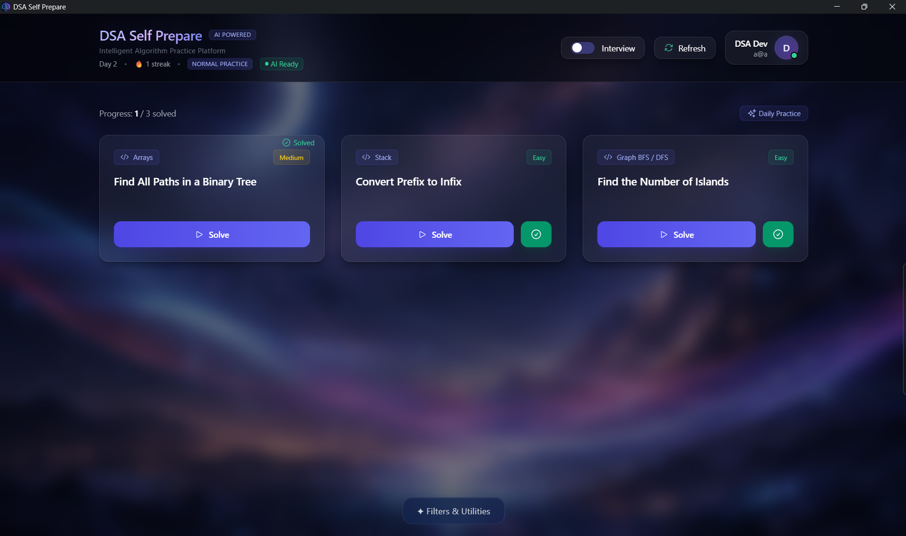
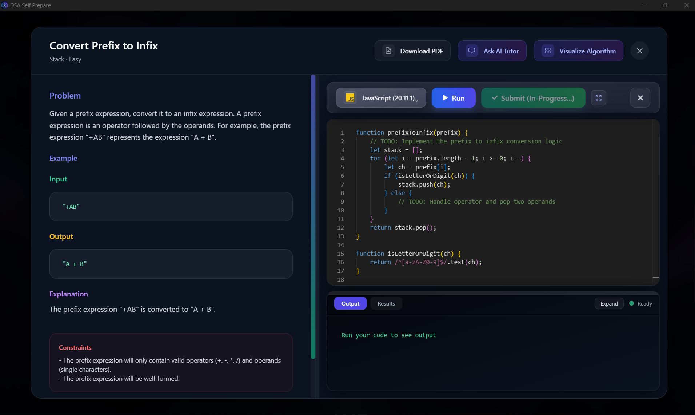
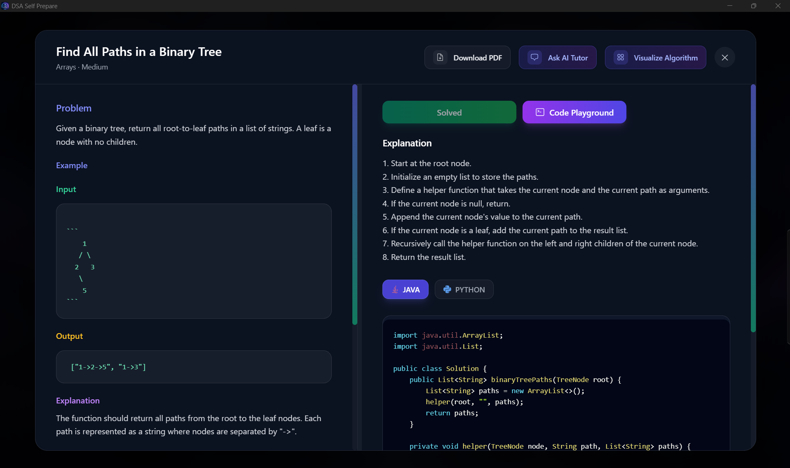
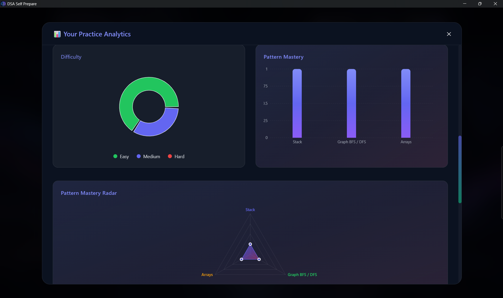
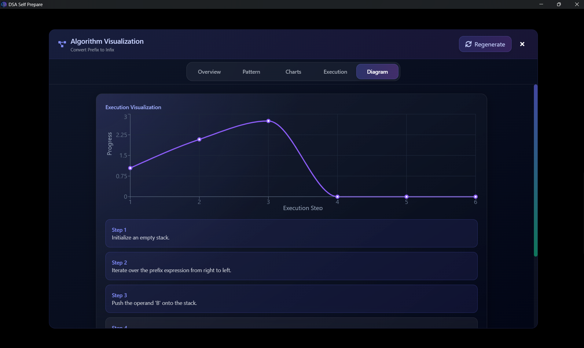
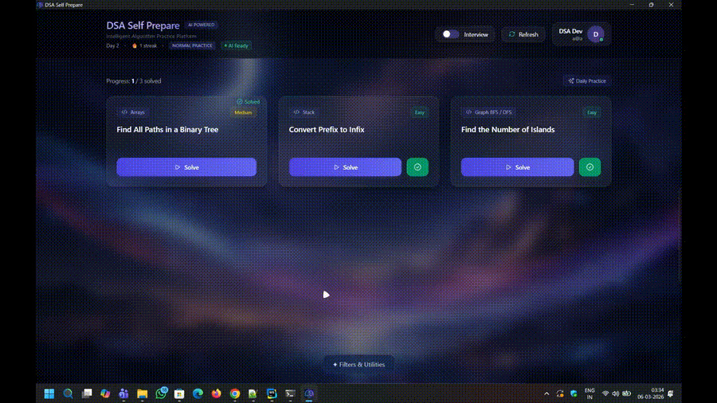

<div align="center">

# 🚀 DSA Self Prepare


<br>


<br>

### 💻 A Powerful Desktop Environment for DSA Practice & Interview Preparation

Practice • Run Code • Simulate Interviews • Track Progress

</div>

---

# 📌 Overview

**DSA Self Prepare** is a **modern desktop platform for mastering Data Structures & Algorithms**.

It provides an integrated environment where developers can:

- Practice algorithm problems
- Run code locally
- Test solutions
- Simulate technical interviews
- Receive AI-based hints

The goal is to provide a **complete coding interview preparation ecosystem in one desktop application**.

Think of it as:

```
LeetCode + Local Code Runner + Interview Simulator
```

all combined into **one powerful desktop tool**.

---

# ✨ Feature Highlights

<div align="center">

| 🧠 DSA Practice | 💻 Code Runner | 🤖 AI Assistance |
|----------------|---------------|------------------|
| Topic-wise problems | Multi-language execution | AI hints |
| Difficulty levels | Instant output | Solution explanation |
| Track solved problems | Error logs | Interview guidance |

</div>

---

# 🎯 Core Features

### 🧠 DSA Practice
- Curated DSA problem sets
- Topic-based learning
- Difficulty levels
- Solve & track progress

---

### 💻 Built-in Code Runner

Execute code instantly in multiple languages:

```
JavaScript
Python
Java
C++
```

Features:

- Instant output
- Error logs
- Runtime execution

---

### 🧪 Test Case Execution

Run solutions with custom test cases.

Features:

- Input validation
- Output comparison
- Edge case testing

---

### 🤖 AI Interview Assistant

AI powered guidance:

- Hint generation
- Problem generation realtime
- Solution explanation
- Optimization suggestions

---

### 🎯 Interview Mode

Simulates a real coding interview environment.

Features:

- Timer based problems
- Performance tracking
- Hint system

---

### 📊 Progress Tracking

Monitor learning progress.

Includes:

- Solved problems
- Coding streak
- Interview readiness

---

# 🖼 Screenshots

## Problem Dashboard


## Code Editor


## Problem View


## AI Generated Progress Analytics Dashboard


## AI Generated Algorithm Analysis


---

# 🎬 Demo



---

# 🧠 Architecture

```
               ┌───────────────────────┐
               │     React Frontend    │
               │   UI + Code Editor    │
               └──────────┬────────────┘
                          │
                          │ Electron IPC
                          │
               ┌──────────▼───────────┐
               │    Electron Main     │
               │   Desktop Runtime    │
               └──────────┬───────────┘
                          │
                          │
                ┌─────────▼──────────┐
                │   Code Runner Core │
                │                    │
                │ JS  Python  Java   │
                │ C++ Runtime Engine │
                └─────────┬──────────┘
                          │
                          ▼
                ┌─────────────────────┐
                │ Execution Results   │
                │ Output / Errors     │
                └─────────────────────┘
```

---

# 🏗 Tech Stack

### Frontend

```
React
TailwindCSS
Monaco Editor
```

---

### Backend

```
Node.js
Electron IPC
Local Code Runner Engine
```

---

### Desktop Framework

```
Electron
```

---

### AI Integration

```
LLM based hint system
LLM based problem generation daily
LLM based AI powered analytics system
LLM based Algorithm Analysis system
Realtime Chatbot 🤖
```

---

# 📂 Project Structure

```
dsa-self-prepare
│
├── electron
│   ├── config
│   ├── events
│   ├── services
│   ├── resources (excluded in git repo as heavy size)
│   ├── utils
│   ├── main.js
│   ├── preload.js
│
├── src
│   ├── components
│   ├── states
│   ├── types
│   ├── ui
│   ├── services
│   └── util
│
├── public
├── screenshots
├── package.json
└── README.md
```

---

# ⚙️ Requirements

Before running locally install:

```
Node.js >= 18
```

Download

```
https://nodejs.org
```

---

# 🧰 Required Language Runtimes

| Language | Runtime |
|--------|--------|
| JavaScript | Node.js |
| Python | Python 3 |
| Java | JDK 17 |
| C++ | GCC |

Verify installation:

```
node -v
python --version
java -version
g++ --version
```

---

# 🚀 Running Locally

### 1️⃣ Clone Repository

```
git clone https://github.com/Adityansh2334/dsa-studio-ai.git
```

```
cd dsa-studio-ai
```

---

### 2️⃣ Install Dependencies

```
npm install
```

---

### 3️⃣ Run Development Mode

```
npm run dev
```

This launches:

```
React UI
Electron Desktop Window
```

---

# 📦 Build Desktop Application

To generate executable:

```
npm run build
```

Output:

```
release/
```

Example file:

```
release/DSA-Self-Prepare-Setup.exe
```

---

# 🔐 Security

The application executes code in a **controlled runtime environment**.

Security measures:

- Sandboxed execution
- Controlled runtime
- No system access for user code

---

# 📈 Future Roadmap

Upcoming features:

- Online judge system
- Cloud sync
- Company wise interview questions
- AI solution explanation
- Leaderboard
- Collaborative coding

---

# 🤝 Contributing

Contributions are welcome.

Steps:

```
Fork repository
```

Create branch

```
git checkout -b feature-name
```

Commit

```
git commit -m "Added feature"
```

Push

```
git push origin feature-name
```

Open Pull Request.

---

# 👨‍💻 Author

**Aditya Kumar Behera**

Happy Developer & Engineer 😊

Building modern developer tools and AI driven platforms.

---

# ⭐ Support

If this project helped you:

Give it a ⭐ on GitHub.

---

---

# 🔗 Resources

The required resources and compiled application are available via Google Drive.

### 📦 Resources Package
Contains additional project resources required for the application.

🔗 **Download RAR File**  
https://drive.google.com/file/d/1q78Lj4spQqKKopwuoIyuiSfFmnuTHaaD/view?usp=drive_link

---

### 💻 Desktop Application
Download the compiled Windows executable to run the application directly.

🔗 **Download EXE File**  
https://drive.google.com/file/d/16Wyw14F-lDanUo9lHQARbkdftAI39dGl/view?usp=drive_link

---

<div align="center">

### 🚀 Happy Coding & Interview Preparation

</div>
